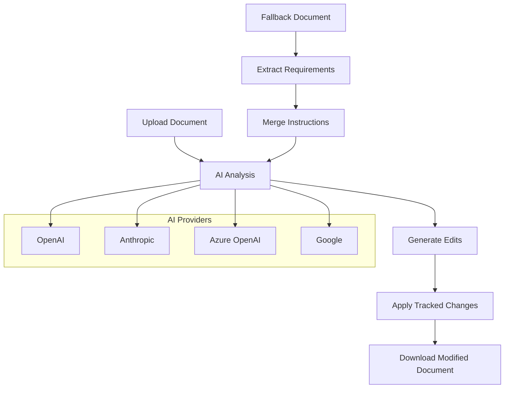

# Word Document AI Processing System

## What It Does

This system processes Microsoft Word (.docx) documents by applying AI-generated edits as tracked changes. Users upload documents, provide natural language instructions, and receive modified documents with Word's native change tracking enabled.

The system supports multiple AI providers (OpenAI, Azure OpenAI, Anthropic, Google) and includes specialized workflows for legal document processing.

## Core Functionality

**Document Processing**: Users upload .docx files and provide editing instructions. The AI generates specific text replacements which are applied as tracked changes with author attribution and timestamps.

**Document Analysis**: The system can analyze existing tracked changes in documents and provide AI-generated summaries of modifications.

**Legal Document Workflows**: Specialized processing for contracts and legal documents, including requirement extraction and instruction merging with fallback documents.

## Technical Architecture

**Backend**: FastAPI application with 8 API endpoints handling different processing workflows
**Frontend**: Streamlit web interface for document upload and processing
**Document Engine**: Python-docx with XML-level manipulation for precise tracked changes
**AI Integration**: LiteLLM unified client supporting multiple providers with automatic failover

## Key Features

- **Multi-Provider AI**: Configurable support for OpenAI, Azure OpenAI, Anthropic Claude, Google Gemini
- **Native Change Tracking**: Uses Microsoft Word's built-in revision system with full attribution
- **Fallback Documents**: Upload secondary documents to provide editing guidance and requirements
- **Legal Processing**: Advanced workflows for contract analysis and requirement extraction
- **Audit Logging**: Processing logs for compliance and debugging
- **API Integration**: RESTful endpoints for programmatic access

## Processing Workflow



## Main Components

**`backend/main.py`**: FastAPI application with processing endpoints  
**`backend/word_processor.py`**: Core document manipulation and XML editing  
**`backend/llm_handler.py`**: Multi-provider AI interface  
**`backend/legal_workflow_orchestrator.py`**: End-to-end legal document processing  
**`frontend/streamlit_app.py`**: Web interface for document upload and processing  

## API Endpoints

- `POST /process-document/` - Basic document processing with AI instructions
- `POST /analyze-document/` - Analyze existing tracked changes  
- `POST /process-legal-document/` - Complete legal workflow processing
- `POST /process-document-with-fallback/` - Process with fallback document guidance
- `POST /analyze-fallback-requirements/` - Extract requirements from fallback documents
- `GET /download/{filename}` - Download processed documents
- `GET|POST /llm-config/` - Configure AI provider settings

## Setup

```bash
pip install -r requirements.txt
cp backend/.env.example backend/.env  # Configure AI provider and API keys
uvicorn backend.main:app --reload --host 0.0.0.0 --port 8000
streamlit run frontend/streamlit_app.py
```

## Current Status

The system includes completed implementations for:
- Basic document processing with tracked changes
- Multi-provider AI integration 
- Legal document parsing and requirement extraction
- Fallback document integration with instruction merging
- Comprehensive test suite with pytest

The system is designed for document workflows where change tracking, attribution, and audit trails are required.